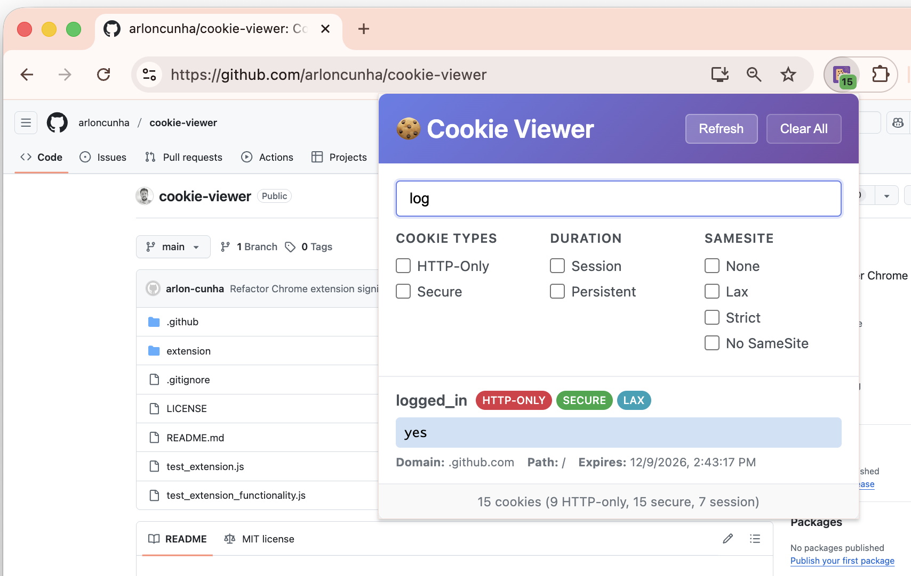

# Cookie Viewer Chrome Extension

[](https://opensource.org/licenses/MIT)
[](https://developer.chrome.com/docs/extensions/)
[](https://developer.chrome.com/docs/extensions/mv3/intro/)

A powerful Chrome extension that provides comprehensive cookie viewing and management capabilities for any website, including access to HTTP-only cookies that are normally inaccessible to regular JavaScript.



## 🚀 Quick Start

1. **Clone the repository**
   ```bash
   git clone https://github.com/arloncunha/cookie-viewer.git
   cd cookie-viewer
   ```

2. **Install the extension**
   - Open Chrome and navigate to `chrome://extensions/`
   - Enable "Developer mode" (toggle in top right)
   - Click "Load unpacked" and select the `extension` folder
   - The Cookie Viewer extension will appear in your toolbar

3. **Start using**
   - Navigate to any website
   - Click the Cookie Viewer extension icon
   - Explore all cookies for the current domain

## ✨ Features

### Core Functionality
- 🍪 **Complete Cookie Access** - View both regular and HTTP-only cookies using Chrome's extension APIs
- 🔄 **Real-time Updates** - Monitor cookie changes as they happen on the page
- 🔍 **Advanced Search** - Search through cookies by name, value, or domain with instant filtering
- 🎛️ **Smart Filtering** - Filter cookies by type (HTTP-only, secure, session, persistent)
- 🗑️ **Cookie Management** - Clear individual cookies or all cookies for a domain
- 📊 **Detailed Properties** - View comprehensive cookie information including security flags

### User Experience
- 🎨 **Modern Interface** - Clean, responsive UI with intuitive design
- ⚡ **Fast Performance** - Optimized for quick loading and smooth interactions
- 📱 **Responsive Design** - Works seamlessly across different screen sizes
- 🔒 **Privacy-First** - All data processing happens locally, nothing sent to external servers

## 🔧 Technical Capabilities

### HTTP-Only Cookie Access
Unlike regular web pages, this extension leverages Chrome's `chrome.cookies` API to access HTTP-only cookies, making it invaluable for:

- **Security Analysis** - Audit cookie security configurations
- **Development & Debugging** - Inspect cookie behavior during development
- **Privacy Research** - Understand how websites handle sensitive data
- **Cookie Compliance** - Verify cookie policies and implementations

### Cookie Information Displayed
| Property | Description |
|----------|-------------|
| Name & Value | Cookie identifier and stored data |
| Domain & Path | Scope of cookie accessibility |
| Expiration | Session or persistent with expiry date |
| Security Flags | HTTP-only, Secure, SameSite attributes |
| Size | Cookie size in bytes |
| Creation Time | When the cookie was first set |

## 📋 Usage Guide

### Basic Operations
1. **View Cookies** - Click the extension icon to see all cookies for the current site
2. **Search** - Use the search bar to find specific cookies by name, value, or domain
3. **Filter** - Select filter options to show only HTTP-only, secure, or session cookies
4. **Refresh** - Click refresh to update the cookie list with current data
5. **Clear** - Remove individual cookies or clear all cookies for the domain

### Advanced Features
- **Export Data** - Copy cookie information for external analysis
- **Cookie Statistics** - View summary statistics for the current domain
- **Security Audit** - Identify potentially insecure cookie configurations

## 🏗️ Project Structure

```
cookie-viewer/
├── extension/                 # Extension source code
│   ├── manifest.json         # Extension configuration (Manifest V3)
│   ├── popup.html           # Main popup interface
│   ├── popup.css            # Styling and responsive design
│   ├── popup.js             # Core popup functionality
│   ├── background.js        # Service worker for background tasks
│   ├── content.js           # Content script for page interaction
│   ├── cookie-icon.svg      # Vector icon source
│   ├── icon16.png          # 16x16 toolbar icon
│   ├── icon48.png          # 48x48 management page icon
│   └── icon128.png         # 128x128 Chrome Web Store icon
├── test_extension.js        # Extension testing utilities
├── test_extension_functionality.js  # Functionality tests
├── .gitignore              # Git ignore rules
├── LICENSE                 # MIT License
├── image.png              # README screenshot
└── README.md              # This documentation
```

## ⚙️ Technical Specifications

### Required Permissions
| Permission | Purpose |
|------------|---------|
| `cookies` | Access Chrome's cookie API for reading/writing cookies |
| `activeTab` | Get information about the currently active tab |
| `storage` | Store extension settings and preferences locally |
| `tabs` | Access tab information for cookie domain matching |
| `<all_urls>` | Access cookies from all domains (via host_permissions) |

### Architecture Overview
- **Manifest V3** - Built with the latest Chrome extension standards
- **Service Worker** - Efficient background processing for cookie operations
- **Content Scripts** - Monitor and respond to cookie changes on web pages
- **Popup Interface** - Responsive UI built with vanilla HTML/CSS/JavaScript
- **Local Storage** - All data stored locally using Chrome's storage API

### Browser Compatibility
- ✅ **Chrome 88+** (Manifest V3 support required)
- ✅ **Microsoft Edge 88+** (Chromium-based)
- ✅ **Brave Browser** (Chromium-based)
- ✅ **Other Chromium browsers** with extension support

## 🔒 Security & Privacy

### Privacy Commitment
This extension is designed with privacy as a core principle:

- ❌ **No Data Transmission** - Cookie data never leaves your browser
- ❌ **No Tracking** - Extension doesn't track user behavior or collect analytics
- ❌ **No External Requests** - All processing happens locally
- ✅ **Local Storage Only** - Settings stored using Chrome's secure storage API
- ✅ **On-Demand Access** - Cookies only accessed when extension is actively used

### Security Considerations
The extension requires broad permissions to function effectively. These permissions are used exclusively for:

- **Legitimate Development** - Web development and debugging workflows
- **Security Research** - Authorized security analysis and auditing
- **Educational Purposes** - Learning about web security and cookie behavior
- **Privacy Auditing** - Understanding website data collection practices

## 🛠️ Development

### Local Development
```bash
# Clone the repository
git clone https://github.com/arloncunha/cookie-viewer.git
cd cookie-viewer

# Load extension in Chrome
# 1. Open chrome://extensions/
# 2. Enable Developer mode
# 3. Click "Load unpacked"
# 4. Select the 'extension' folder
```

### Testing
```bash
# Run extension functionality tests
node test_extension_functionality.js

# Manual testing checklist:
# - Test on various websites
# - Verify HTTP-only cookie detection
# - Test search and filter functionality
# - Verify cookie clearing operations
```

### Contributing
We welcome contributions! Please follow these steps:

1. **Fork** the repository
2. **Create** a feature branch (`git checkout -b feature/amazing-feature`)
3. **Commit** your changes (`git commit -m 'Add amazing feature'`)
4. **Push** to the branch (`git push origin feature/amazing-feature`)
5. **Open** a Pull Request

### Code Style
- Use consistent indentation (2 spaces)
- Follow JavaScript ES6+ standards
- Add comments for complex functionality
- Ensure responsive CSS design
- Test across different screen sizes

## 📄 License

This project is licensed under the MIT License - see the [LICENSE](LICENSE) file for complete details.

## ⚠️ Disclaimer

This tool is intended for legitimate purposes including:
- Web development and debugging
- Security research and analysis
- Educational and learning purposes
- Privacy auditing and compliance

**Important**: Users are responsible for ensuring their use complies with:
- Applicable laws and regulations
- Website terms of service
- Privacy policies and data protection requirements
- Ethical guidelines for security research

## 🤝 Support

- **Issues**: Report bugs or request features via [GitHub Issues](https://github.com/arloncunha/cookie-viewer/issues)
- **Documentation**: Comprehensive guides available in this README
- **Community**: Join discussions in the repository's discussion section

---

<div align="center">
  <strong>Built with ❤️ for the web development community</strong>
</div>
